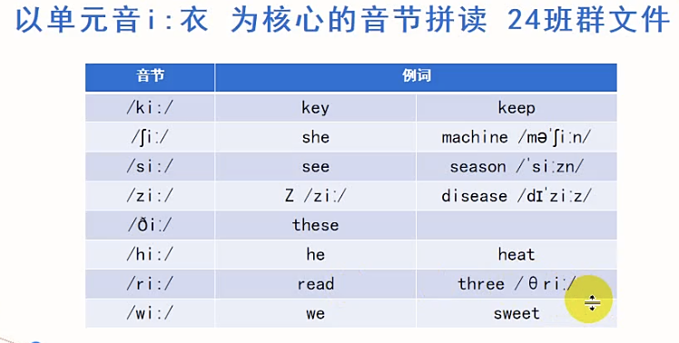
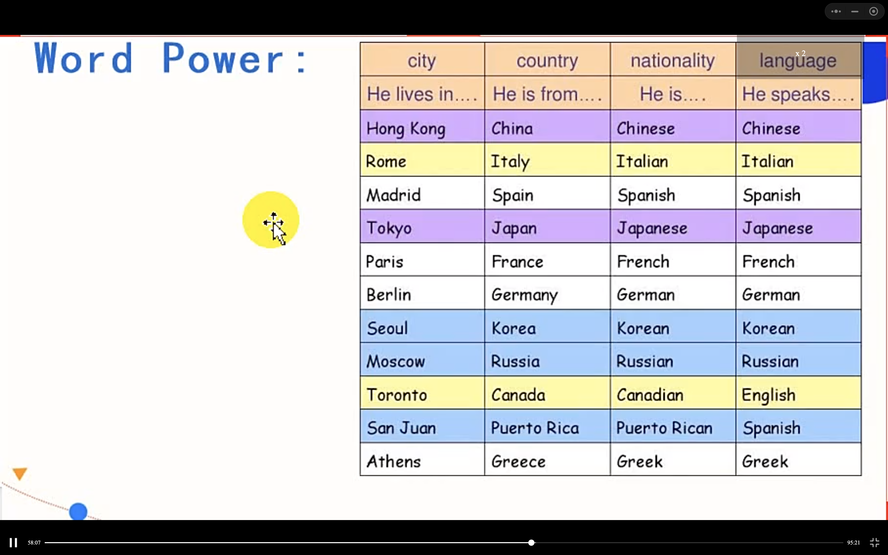
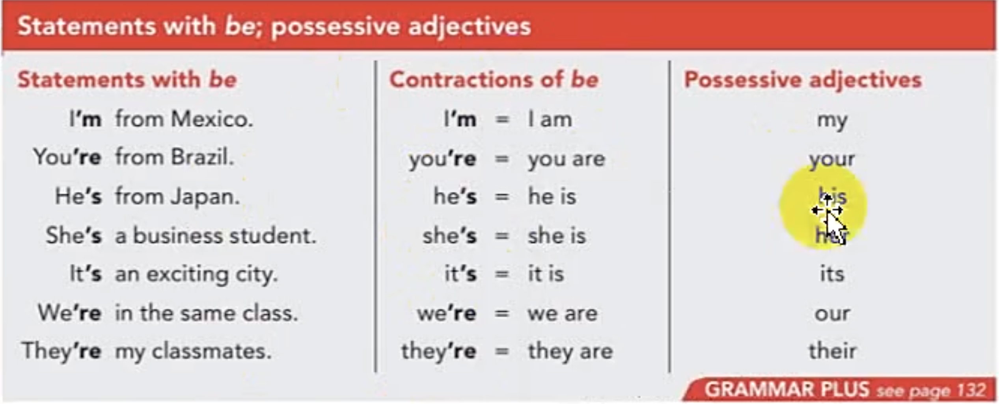
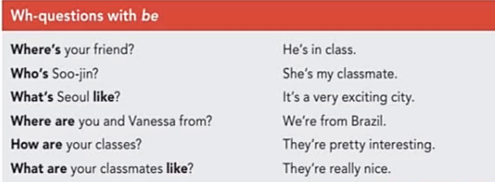

#### 方法
- 三步训练法
  - 第一天听
  - 第二天听写
  - 第三天跟读

- 如何记住对话内容
  1. 缩略词速记


`有序来源于受益`
# Part1 Pronounce  

# Part2 Listening

## 一、会面与闲聊

```
name = given name
last name = family name = surname 姓
full name 全名
first name 名
last name 姓

❗️ first 和 last指位置，具体含义取决于文化背景。

eg：In Chinese culture, the first name is family name.
```

- melting pot 大熔炉
- respectively 各自的
- classmate，schoolmate，soulmate
- win-win 双赢


- 描述来自哪里
  - I'm from XinZhou city, Shanxi Province.
- 如何拼写
  - How do you spell that？

## 二、
Key Points:
1. call sb... 
   - You can call me Danielle
2. This is ... （这位是...）
   - These are ...
3. What's ... like?
   - What's your [apartment | new boyfriend] like?
   - What's the weather like in your city?

- 国家名称
- nationality 国籍，民族


询问国籍
- Where are you from?
- Where do you come from?
- What's your nationality? (`回答时需要用到国籍的形容词`)
  - I am Chinese.
  - She is South Korean.

- When you are in Rome, do as the Romans do. (入乡随俗)

## Part3 Grammer
`be动词 + 形容词性物主代词 + 疑问词`

- `系动词=Be动词+渐变动词 become，turn，get...+感官动词
`
- be = is/am/are（be是 is，am，are的原型）
- `物主代词`：xx的




练习
```
  1. My name is Aiko Yoshida. I'm from Japan. My family is in Nagoya. My brother is a college student. His name is Haruki.

  2. My name is Matias. I' from Santiago. It's a really nice city. My sister is a student here. My parents are in Chile right now.

  3. I'm Angelica, but everyone calls me Angie. My last name is Newton. I'm a student at City College. My parents are on vacation this week.
```
- 特殊疑问词



## Part4 Speaking

