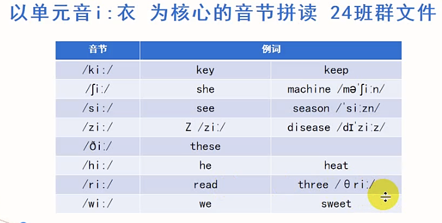
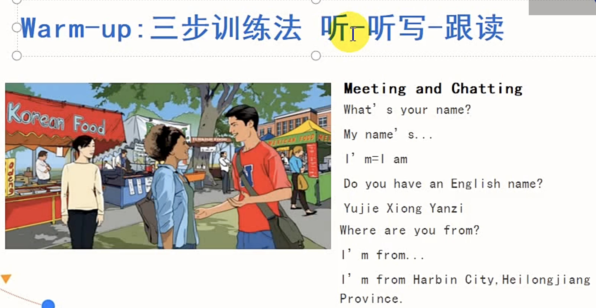
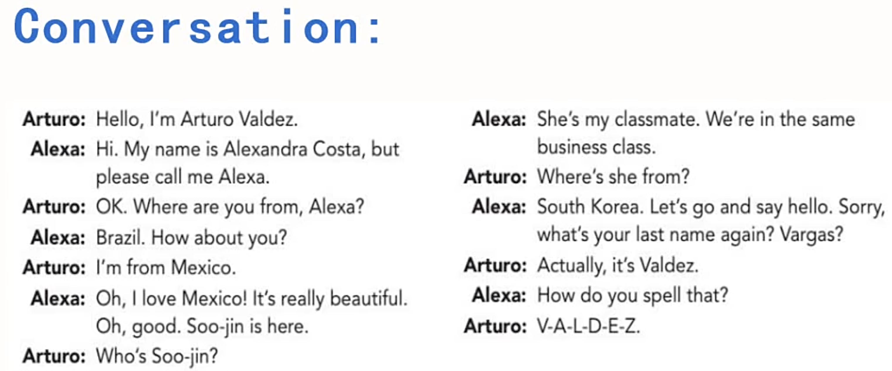
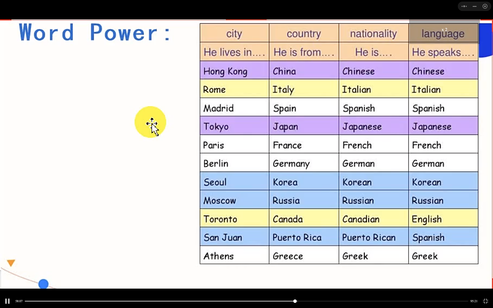
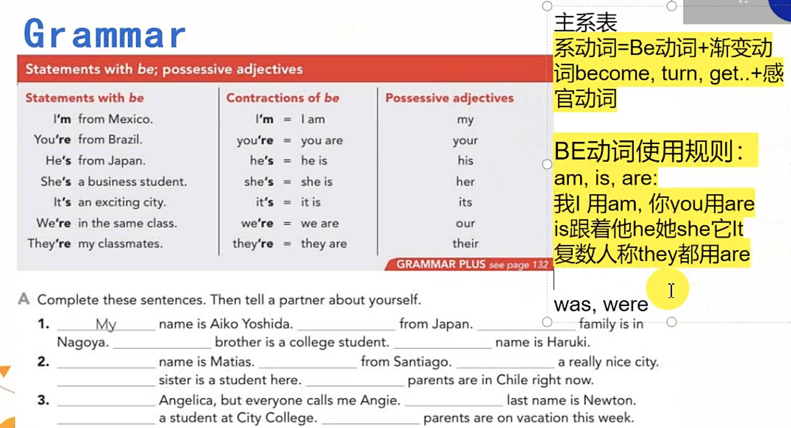
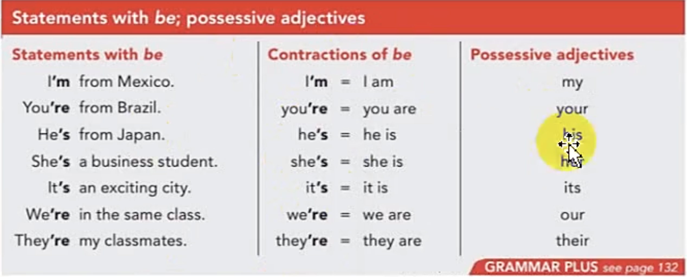

#### 方法
- 三步训练法
  - 第一天听
  - 第二天听写
  - 第三天跟读

- 如何记住对话内容
  1. 缩略词速记


`有序来源于受益`
# Part1 Pronounce  

```
- 音节：辅音+元音构成，以元音为核心
- 学习三部曲：`查，拼，听`
- 重音浊化
```
- There are four seasons in a year.
  

# Part2 Listening
## Warm-up 

- 三步训练法：听，听写，跟读

Meeting and Chatting （会面与闲聊）

```
What's your name?
  - My name's ...
  - I'm
Do you have an English name?
  - Yujie

Names: 
  - Arturo/Mexico/Mexican
  - Alexa/Brazil/Brazilian
  - Soo-jin/South Korea/South Korean


My name is Danielle, but you can call me Dan/but please call me Dan.

```
- ⚠️ 语言的前面不能加定冠词 the
- ⚠️ 不能用逗号连接两个英文句子，可以加个 but。

## Conversation

## Questions：
你是哪里人
Where are they from respectively?

Where are you from?
  - I'm from ...
Where does XX come from? 

What nationality is XX? 
He is Mexican.


## Culture and Custom（文化习俗）
name = given name
family name = surname 姓
full name 全名
first name 名
last name 姓


❗️ first 和 last指位置，具体含义取决于文化背景。

eg：In Chinese culture, the first name is family name.

## Conversation


This is XXX. These are my workmates.

- melting pot 大熔炉
- respectively 各自的
- classmate，schoolmate，soulmate
- win-win 双赢


- 描述是老乡
  - We're from the same city/county.


- 描述来自哪里
  - I'm from XinZhou city, Shanxi Province.
- 如何拼写
  - How do you spell that？

## Key Points:
1. call sb... 
   - You can call me Danielle
2. This is ... （这位是...）
   - These are ...
3. What's ... like?
   - What's your [apartment | new boyfriend] like?
   - What's the weather like in your city?

- 国家名称
- nationality 国籍，民族

需要背下来‼️


询问国籍
- Where are you from?
- Where do you come from?
- What's your nationality? (`回答时需要用到国籍的形容词`)
  - I am Chinese.
  - She is South Korean.

- When you are in Rome, do as the Romans do. (入乡随俗)

# Part3 Grammer
需要背下来‼️

`be动词 + 形容词性物主代词 + 疑问词`


- be = is/am/are（be是 is，am，are的原型）
- 主系表
  - 系动词 = Be动词 + 渐变动词 becomde, turn, get..+感官动词

`Be动词使用规则`
我用 am，你用 are， is跟着他她它，复数人称都用 are。
- `物主代词`：xx的




练习
```
  1. My name is Aiko Yoshida. I'm from Japan. My family is in Nagoya. My brother is a college student. His name is Haruki.

  2. My name is Matias. I' from Santiago. It's a really nice city. My sister is a student here. My parents are in Chile right now.

  3. I'm Angelica, but everyone calls me Angie. My last name is Newton. I'm a student at City College. My parents are on vacation this week.
```
- 特殊疑问词


## Greeting

## Hello
1. Have a good day.
   1. Thank you. You, too.
2. Hi. How are you? 
   1. Pretty good, thanks.
3. What's up? Oh, 
   1. not much.
4. Good morning.
   1. Good morning.
   2. 
## GoodBye

# Part4 Speaking

## Practice