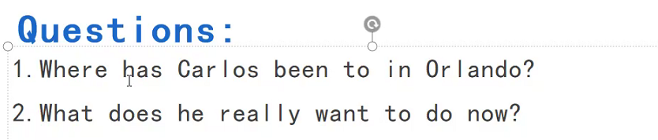

# Grammar
意合：（中文）
形合：（英文）

谓语动词的时态
- 一般现在时：习惯
  - She has(实意动词：have + does) a brother.
  - 变否定句：Does she have a brother.
- 现在进行时：正在进行
- 一般过去时：过去某个时间发生的动作
- 现在完成时：1. 过去动作对现在在的影响；2. 从过去开始一直持续到现在的动作
have/has + 过去分词
时间状语：for + 一段时间
  - already肯定句
  - yet否定句和疑问句
  - ever
  - once 
当主语是第三人称单数用 has
  She has lived in the city for ten years.
  Has she lived in the city for ten years? Yes, she has. / No, she hasn't/.
  How long has she lived in the city? For ten years.

  - Would you like to go to see a movie with me?
    - I saw a movie yesterday.（一般过去时，与现在无关）
    - I have seen a movie.（现在完成时，对现在产生影响）

  I lived in the city for ten years.（过去曾经有十年在这个城市度过）
  I have lived in the city for ten years.（到现在为止的十年）

## 练习

Have you done much exercise this weeek?
Yes, I have already been to Pilates class four times.

Have you played any sports this month?
No, I didnt have the time.
  - 修正：I don't have the time.

How many movies have you seen to this month?
Actually, I haven't seen any yet.
  
对比两种时态的区别（现在完成时和一般过去时）

## 练习

# Warm-up: leisure time

## 问题

## Conversation

- It's great to see you again
- I know what.

## Practice

 