# Grammar
Tips：
- 形容词（的）
- 副词（地）
形容词修饰名词，副词修饰动词、形容词、副词

- He runs really fast.
- He runs faster than me.
- He runs the fastest in the class.

---

- extreme + ly = extremely
- beautiful + ly = befutifully
happy + ily = happily
great + ly = greatly
amazing + ly = amazingly

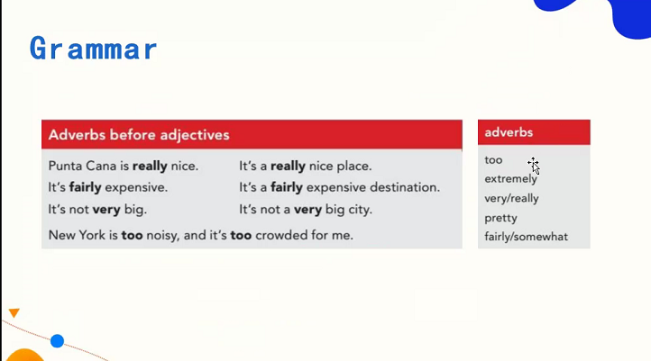

# Grammar
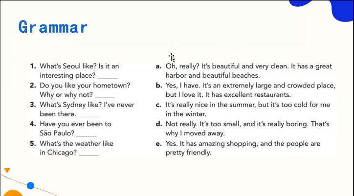 
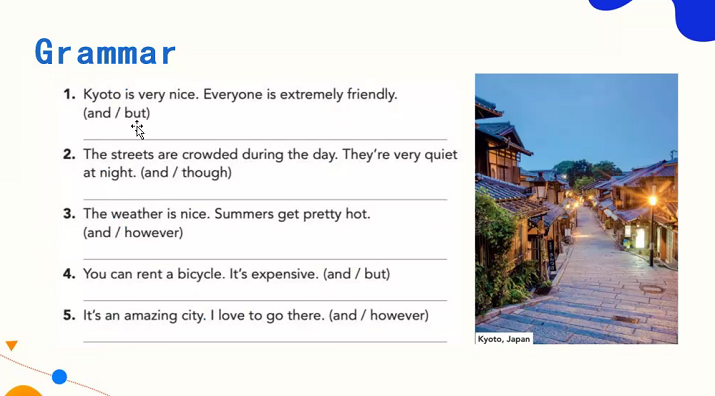

- however是个高级的 but, however 后面需要加逗号。

1. Kyoto is very nice and everyone is extremely friendly.
2. The streets are crowded during the day. They're very quiet at night, though.
3. The weather is nice. However, summers get pretty hot. 
4. You can rent a bicycle, but it's expensive.
5. It's an amazing city and I love to go there.

# Grammar
英文中的小情绪：v.aux

情态动词：能力、命令、需求、义务
- can 能够
- should 应该
- need 需要
- could 可以
- must 必须

```
1. 情态动词 + 动词原形
2. 情态动词 + not + 动词原形

变疑问句时，需要助动词（be动词，情态动词，do/does/did/have/has）

```


# Grammar
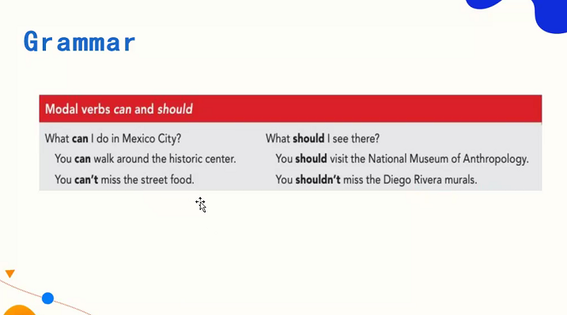

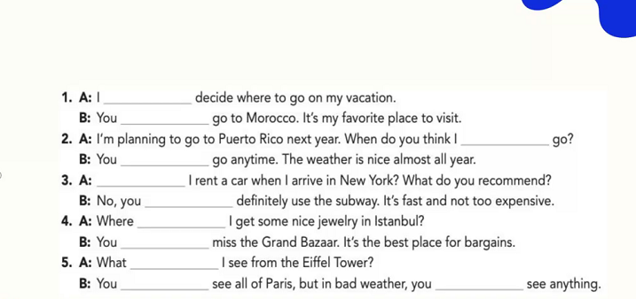

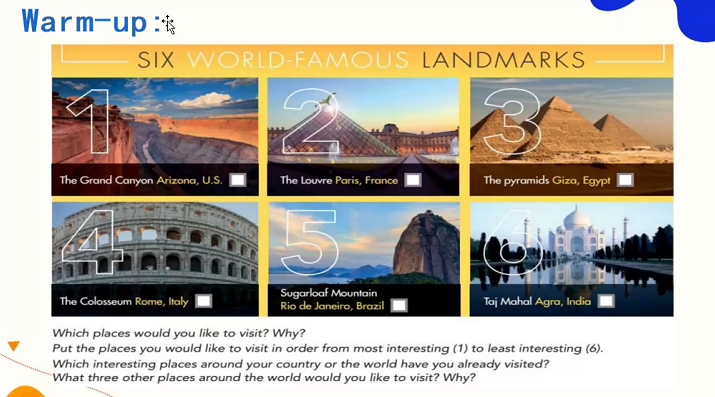

I would like to go to the Grand Canyon, because I like nature and spectacular scenery.

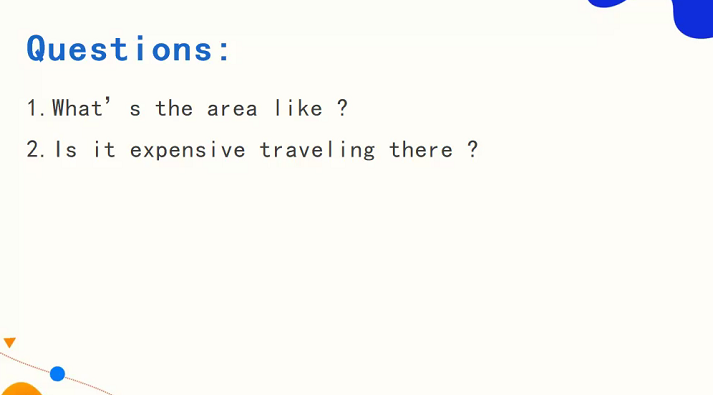

```
如何听情景对话？

- 碎片化信息，根据合理的想象将它们串联起来。
- 情绪-客观用词
  - cool
  - beautiful
  - great
  - relaxing
  - fantastic 
  - interesting
```
relaxing adj. 令人放松的
relaxed adj.  感到放松

Q1:
It is really beautiful with fantastic beaches and clear water.

Q2: 
No, the prices are reasonable.

```
- 咬舌音
- 失去爆破：有力道，失去声音
```
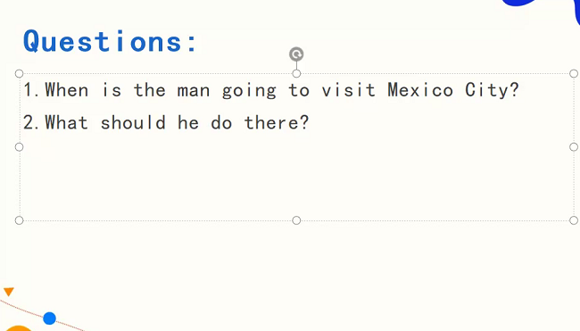
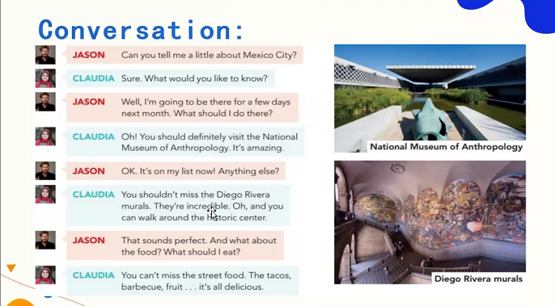

男孩要去墨西哥，想咨询女孩去了可以做什么。女孩说可以去博物馆，历史中心。男孩问有么有什么吃的，女孩说可以尝尝街边的塔可。

He should go to visit the museum and historical centre. And taste street food. The tacos, barbecue fruit.


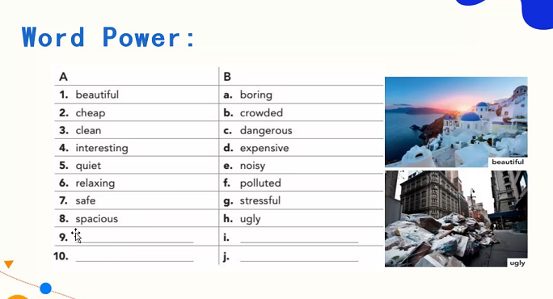
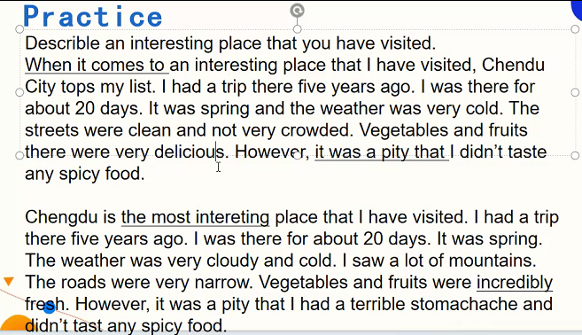
