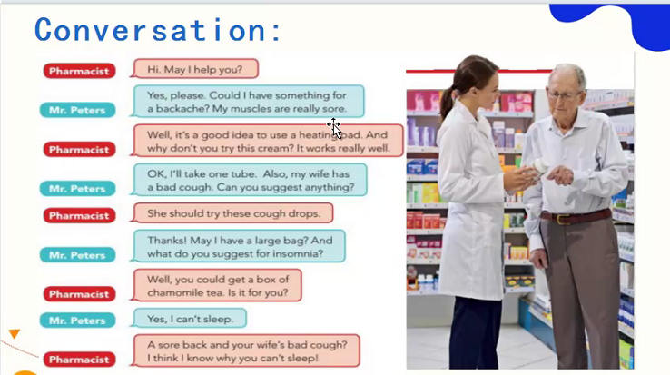

## Warm-up


- insomnia（失眠）
- a headache
- a cough
- a cold
- the flu
- a stomachache
- a backache
- sore muscles

```
I have been headache several times in the past year. 
I had a terrible cough last summer.
I had insomnia last month.
```

- last year（搭配一般过去时）
- in the past year（搭配过去完成时）

# Grammar


It's important not to eat sqicy food.


- 学有余力时，可以每天两篇课文的三步训练法，一个回放内容
- 重复，重复（第一周重复）

- break （短暂的）
- rest （时间较长）

- take的使用场景
  - take medcine
  - take English classes
  - take a subway
  - I'll take it.
  - take a break.


情态动词

- should 应该，建议
- may 可以，请求
- could 可以，请求，建议
- can 能够，请求，建议


祈使句：给出建议，发出命令




- lotion 乳液
- itchy eyes 结膜炎
- eyedrops 滴眼液


# Practice

