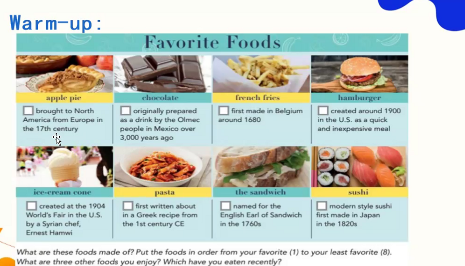
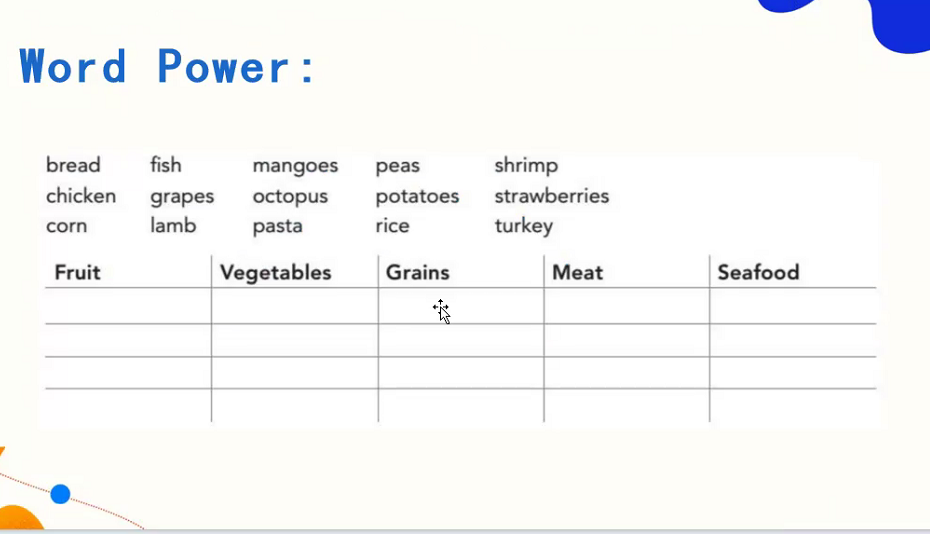
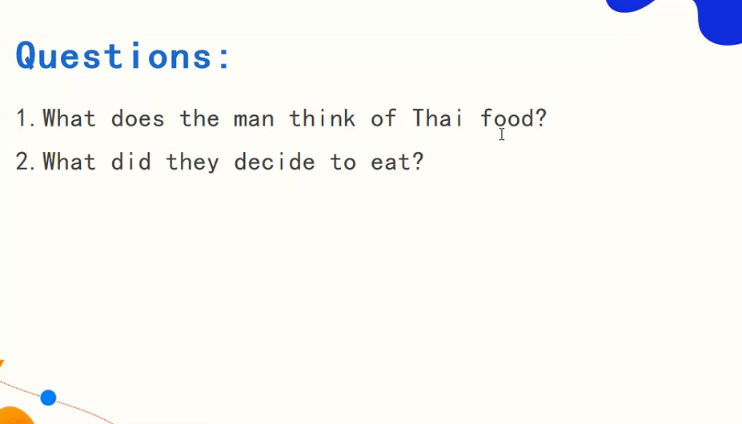
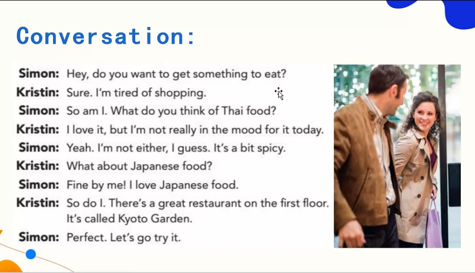
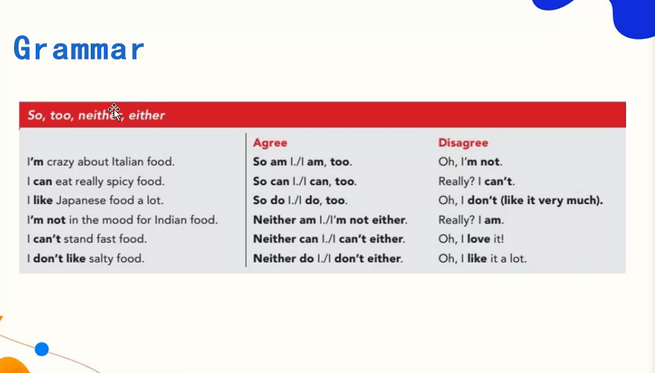
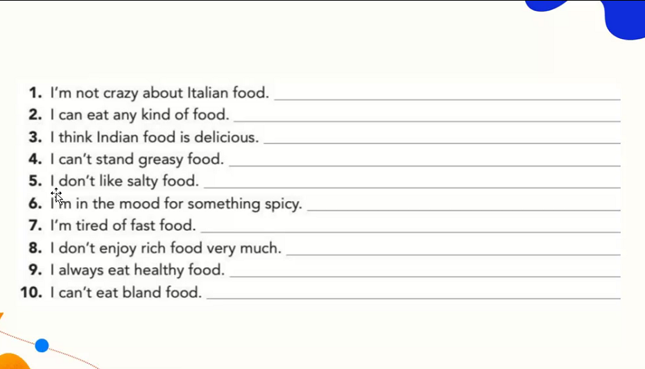
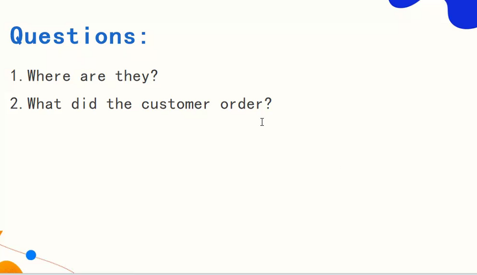
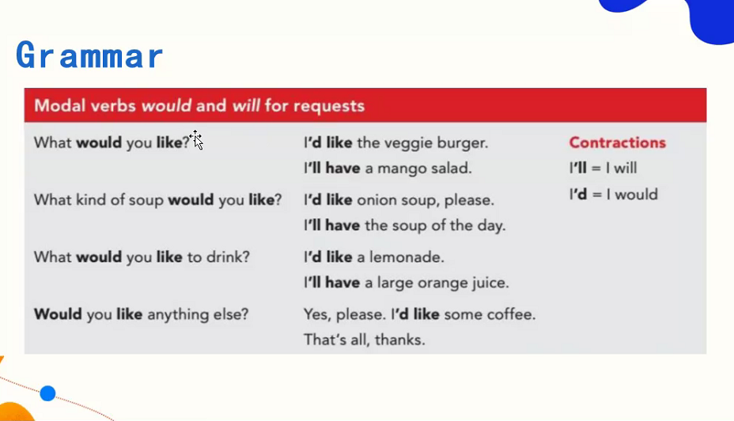
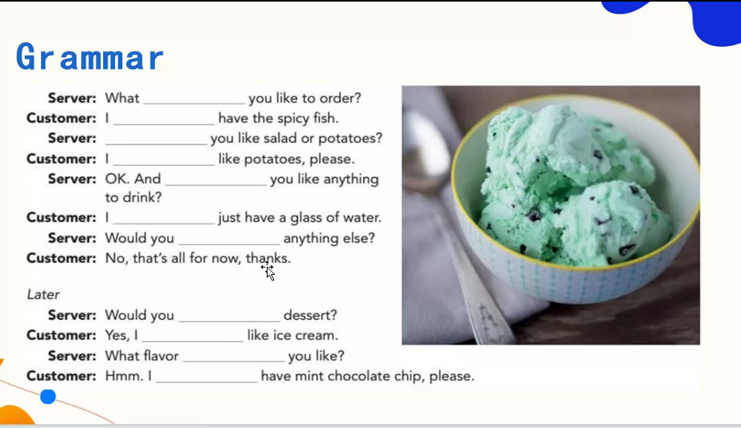

## Warm-up






## Grammar

- I am a student. So am I.
- My son is a student. So is my daughter.
- I am a teacher. So is he.
- `I'm not a student. Neither is she.`    
- `I can't speak Japanese. Neither can I.`
- I love it. So do I.
- He drove to work yesterday. So did I.
- I have seen the film. So have we.
- He hasn't done his homwork. Neither have I.
- I am reading. So is she.
- We shouldn't be late. Neither should they.
- I can't see it. Neither can we.

`总结`:
1. 肯定句：So + 助动词 + 主语
2. 否定句：Neither + 助动词 + 主语

`助动词：助动词的数（do/does等）根据主语来决定`
  - be
  - can
  - should
  - do
  - does
  - did 
  - have 
  - has
---





## Grammar


- 固定搭配：
  ```
  - would like
  - will have
  ```

## Pratice



- Have you ever eaten turkey?（你吃过火鸡吗）
- `16世纪`：1700s, 代表 1600-1699
- 
  ```
  chef: 大厨
  cook: 一般厨师
  ```

### 短语积累
  - decide/want to do sth.
  - be tired of doing sth.
  - in the mood for sth. （有心情做...）
  - fine by me.
  - something to eat

  - so do/am I. （用do 或者 am 取决于上文的动词）
  - a bit / a little 
  - veggie burger.（素汉堡）

### 发音技巧
- `元音前面的  the 念 /they/（类似发音）`

### 语法经验：


- 语境来自于大量语料，语境高于语义和语法
- 习惯高于所谓的语法
- 直接经验 + 间接经验

`学习时，把眼光放在自己身上。`