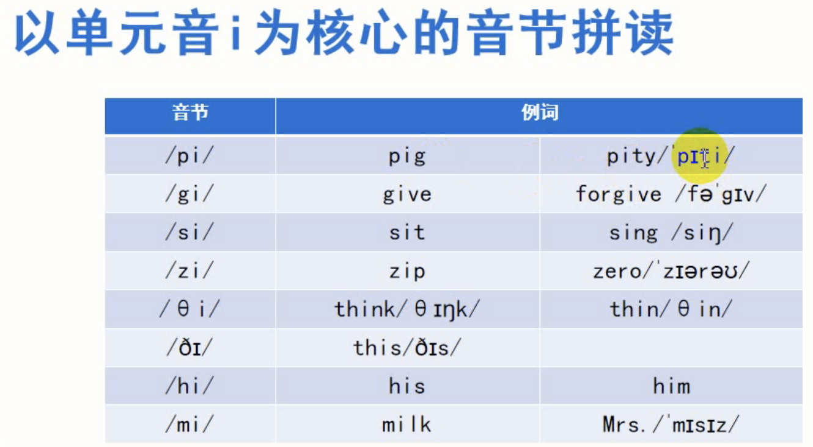
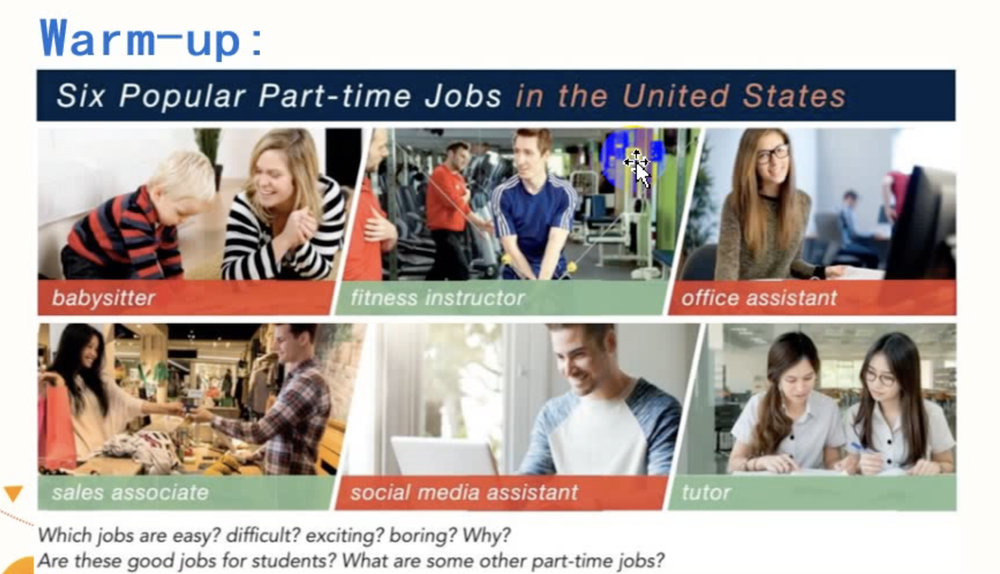
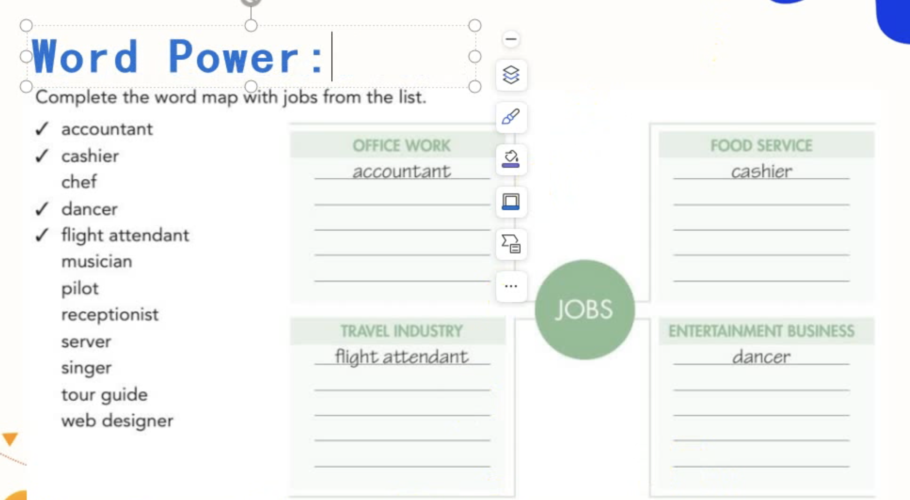
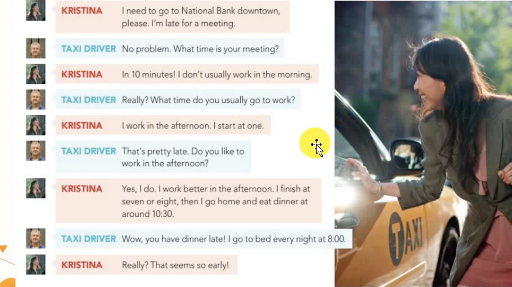
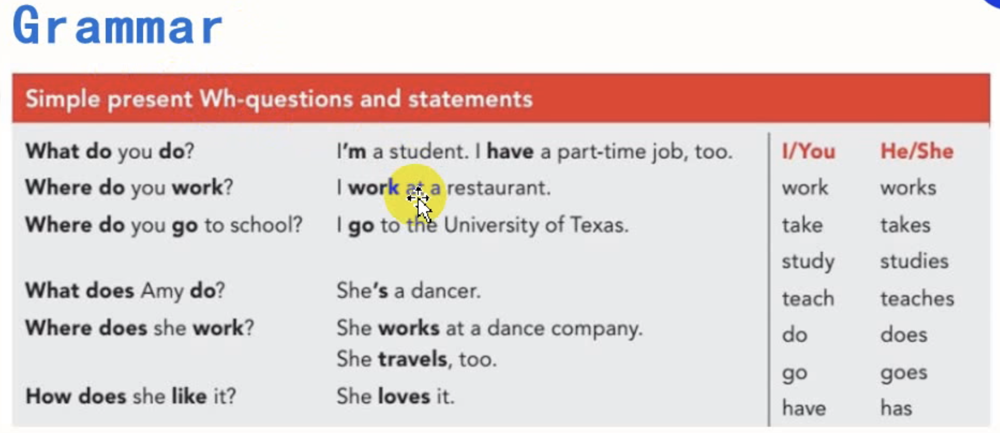
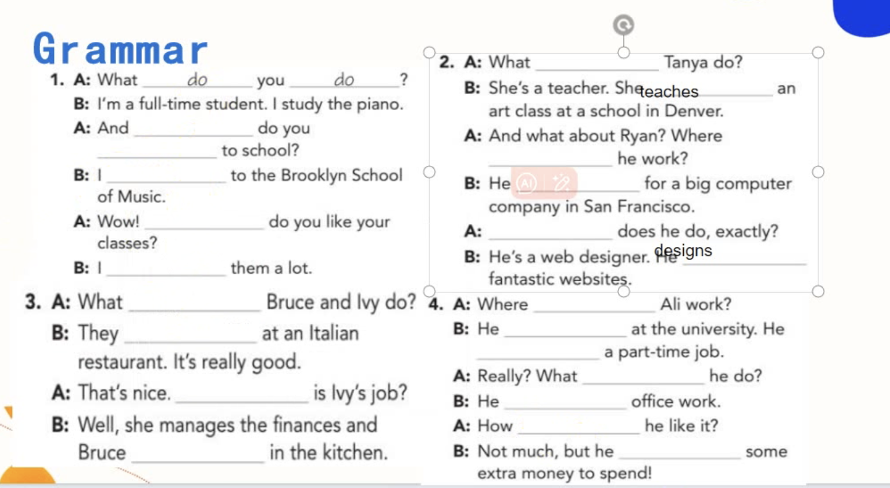
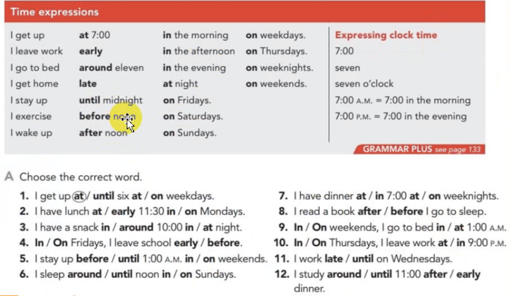
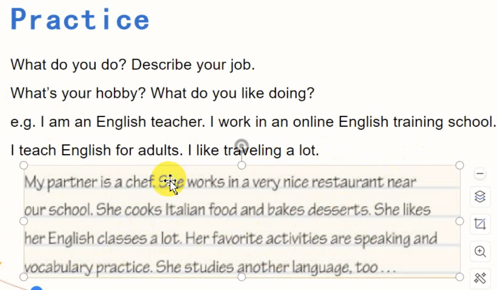

# Pronunciation

## 以单元音i为核心的音节拼读

- 英文所有短音都是丹田用力

单元音 i

What a pity.

- Mrs.（太太）
- Ms.（女士）约 25岁以上
- Miss（更年轻的女士）

# Listening
## Warm-up（在美国六个受欢迎的兼职工作）

Six Popular Part-time Jobs in the United States
- babysitter
- fitness instructor
  - er，or一般会是动作发起的人
  - 后缀-ness，er，or
- office assistant
- sales associate
- social media assistant
- tutor

- Which jobs are easy? difficult? excitiing? boring? Why?
- Are

- Have you ever done part-time jobs?
  - Yes, I have. I was a turtor.
  - Yes, I have. I was a server at KFC. I can be a waiter.

## Questions
1. What are their part-time jobs?
   - Derek is a server and Amy is a dancer.
2. How do they like their jobs?（他们对工作的喜欢程度）
   - Derek thinsk his job is OK and he feels tired.Amy think her job is a little difficult but she loves it.

## Key Points
1. 询问工作
   - What do you do?
   - What's your job?
     - I'm a teacher. part-time... full-time...

2. 询问工作的喜爱程度
   - How do you like ...? 
   - What's ... like
     - I don't like it, either.
   
- on one's feet 站着
- on one's knees 跪着

3. be late for school/work/a meeting
4. in + 一段时间 = 一段时间以后，跟一般将来时连用
---

## Questions
1. When is Kristina's meeting?
2. What time does Kristina start work?
3. What time does she finish work?
4. What tiem does the driver go to bed?

# Grammar

`语法在于积累`

`一般现在时描述习惯性或经常性的动作`
    - 谓语动词用动词原形
    - 主语是第三人称单数时，谓语动词用单三形式（-s/-es）（do/does）
  
练习

- 具体时间用 at
- 时间段，年和月份都用 in
- 在某天用 on
- on Fridays（每逢周五）
- on weekends（每逢周末）

# Speaking
## Practice
