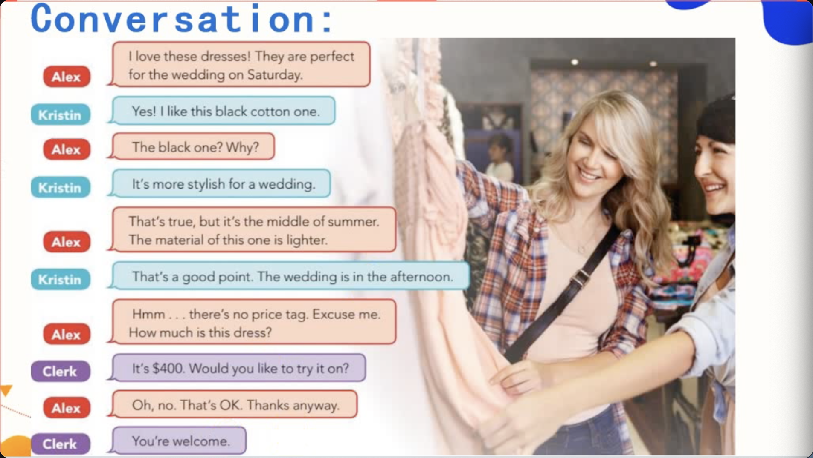

# Pronouncation

`对口语标准要求高的或者考雅思，需要将音标专题课程：需要练习 3-4周`，到 QQ找老师校对发音。
初级阶段：培养英语学习的方式

以单元音 e为核心的音节拼读要领：
- 短促有力，嘴巴不用力
- 微笑音，假笑，丹田用力

# Listening


初学需要机械记忆

练习
- What colors do you like to wear?
    - I like to wear black.


## Conversation 1


- A: Because he wants to buy a present for his sister as a birthday.

```
英文中钱不可数：How much
浅色：light + blue
深色：dark + blue
打折：on sale
150美元：one hundred `and` fifty
```

- 先会后学的规则
- 口语表达追求用最简单的词表达复杂的意思，应对交集的能力
- 练习听力时，需要留意时间、地点、人物关系

## Conversation 2



- A: Because they need to attend a wedding on Saturady.
- A: They don't take any dress. Maybe because they don't have enough money.

## Vocabulary
1. until
    - 持续性动词 until + 动作截止时间
      - We slept until 12'o clock at noon.
      - I will wait until 5'o clock in the afternoon.
    - 短暂性动词 not...until + 动作发生时间
      - I didn't leave until he came back.
      - We didn't arrive until the rain stopped.
2. pretty   
   - adj. 漂亮的 
      1. pretty boy
   - adv. = very，修饰形容词
3. need 
   - 实意动词，有单三、过去式，后面 + to do
     - You need to hand out the materials.
     - Do I need to hand out the materials.
   - 情态动词，没有单三、没有过去式，后面 + do
     - You need hand out the meterials.
     - Need I hand out the materials?
4. sale 
   - sell

# Grammar


- 黑发 dark hair
- 白发 grey hair


# Grammar


`音节是指元音的个数`
单音节和大部分双音节比较级 + er，最高级 + est

少数双音节词和多音节词 比较级 more～，最高级 the most

# Practice

