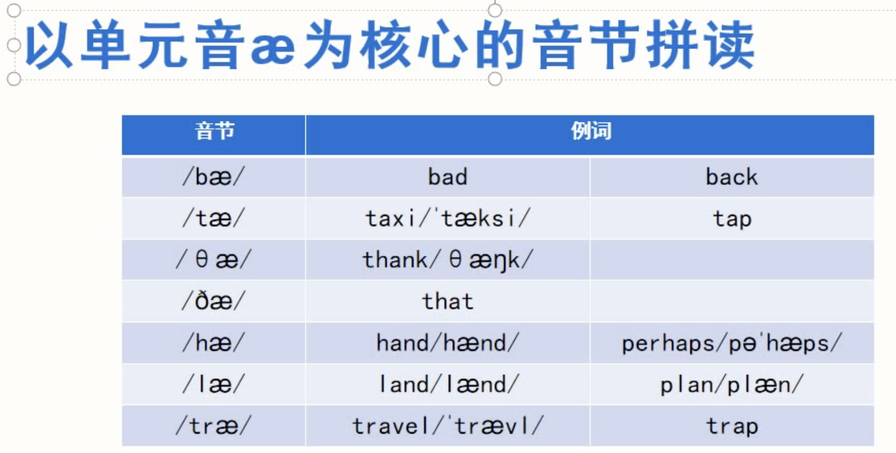
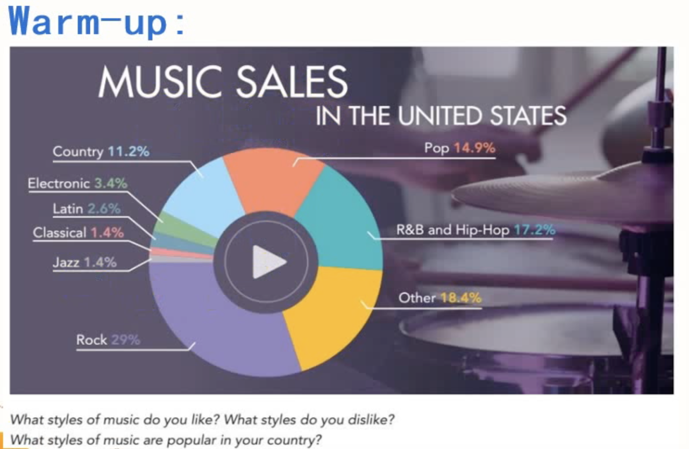
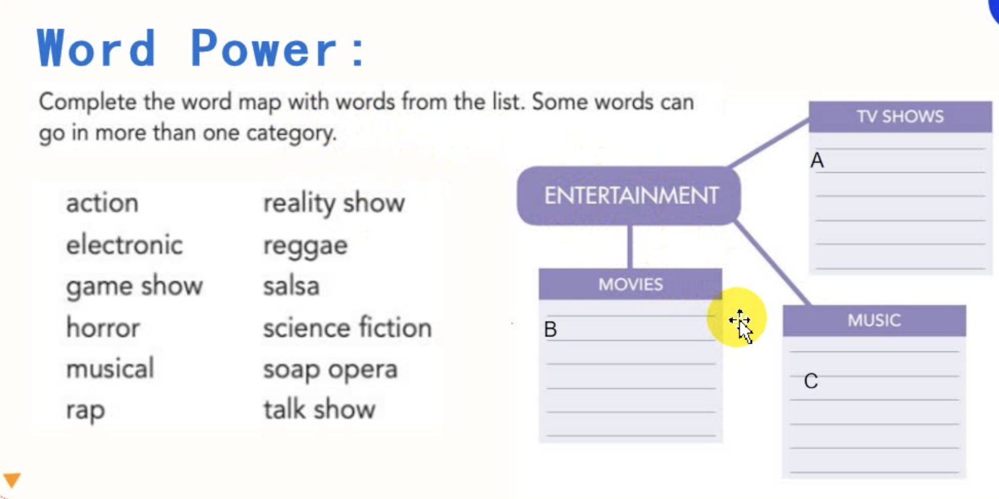
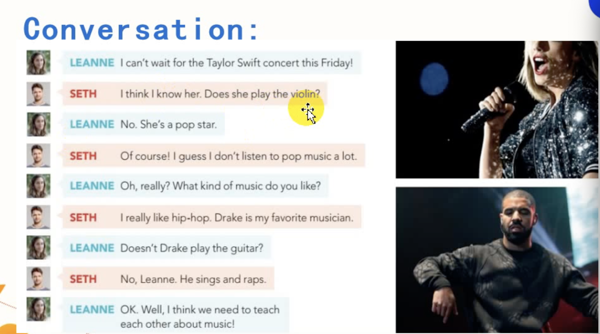
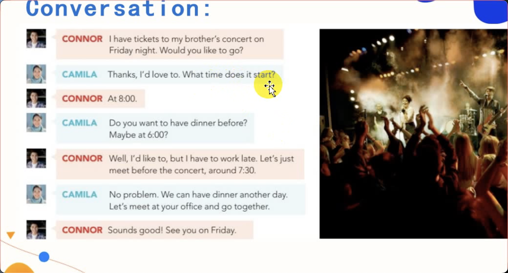
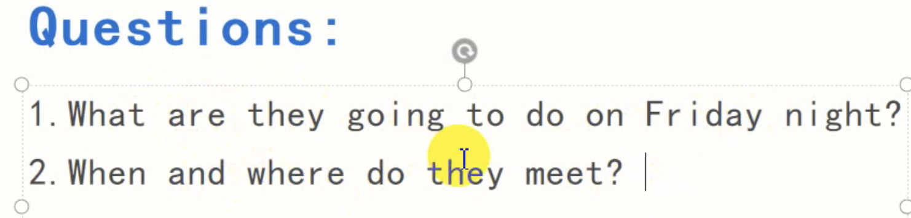
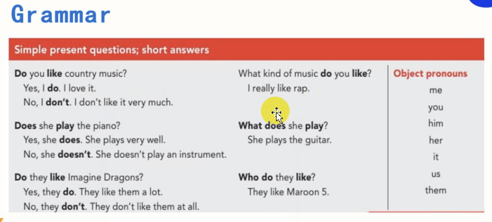
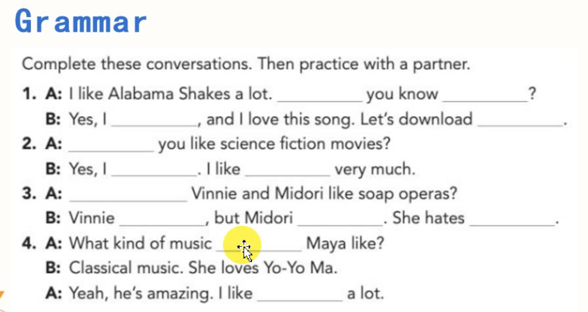
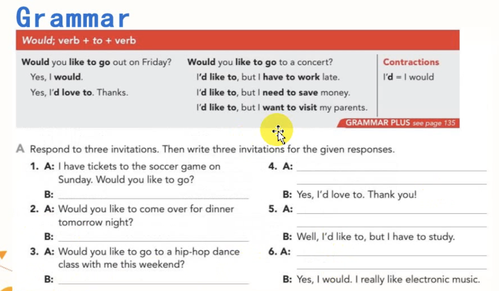
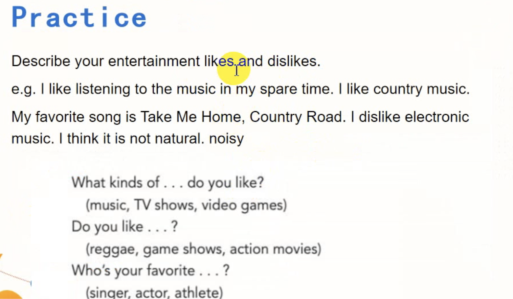

打卡点评

- 基础阶段：训练提升打基础的方法就是`机械`
- 走出舒适区
- 语言是现象性学科

1. 第一关：听
   - 泛听，要求在不间断的条件下，听完第一遍可以将大概内容讲述出来
   - 反应不过来的，要注意发音和听的
2. 第二关：听写
   - 提升写的速度，多背单词，每周复习总结
   - 用自己习惯的小符号，小缩略替代
3. 跟读

# Pronunciation

`呕吐音`发音要领
- 嘴巴张到最大，喉咙根部上抬，丹田用力，嘴巴定点不动
- 声音效果也是 ai，和微笑音的音质是一样的，一个是扁扁的，左右咧开，一个是嘴巴张到最大。就像要吐了似的。

## Warming-up

音乐销量
- Country   11.2%
- Electronic    3.4%
- Latin 2.6%
- Classical 1.4%
- Jazz  1.4%
- Rock  29%
- Pop   14.9%
- R&B   and Hip-Hop 17.2%
- Other 18.4%
  - Reggae
  - Folk
  - Soul
  - Musical
  - World
  - Disco
  - march
  - funk
  - childrens
  - new age

 Q：What styles of music do you like? What styles do you dislike?

 A: I like country music and pop music.

## Word Power

Q：What kind of movie do you like watching best?

A: I like watching romance [movies] best.

# Listening

## Questions
Q: What kinds of music do they like?

A: The girl likes pop music. The boy likes hip-hop.

`失去爆破`：爆破音后面遇到不一样的辅音时，有力道没声音。

- need to，实义动词；如果是情态动词后面加动词原形。

## Conversation

They are going to a concert

- 一般现在时，习惯性
  - 谓语动词：动词原形/单三
  - 否定句和疑问句，do/does
- `时态 = 时间 + 状态`，从两个维度描述
  - 时间 = 过去 + 现在 + 将来 + 过去将来
  - 状态 = 进行 + 完成 + 一般 + 完成进行

# Grammar

- 动词不定式
  - want/hope/like to do

# Speaking

- tickets to ...
- 讲述时间，通常都是一般现在时
- a deal（说定了）
- 英文歌的首字母要大写