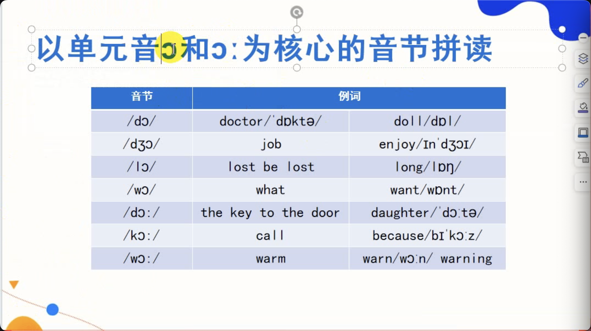
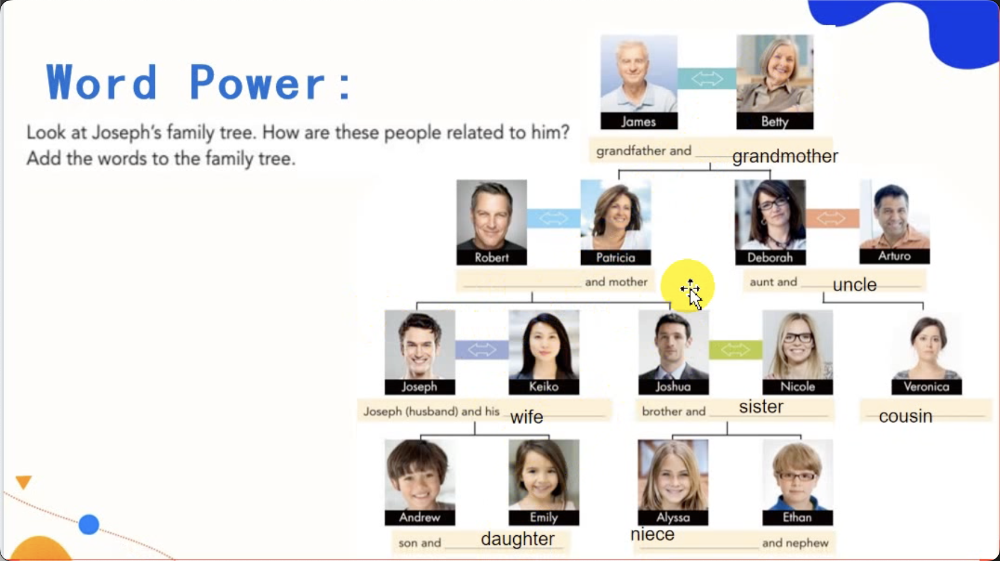
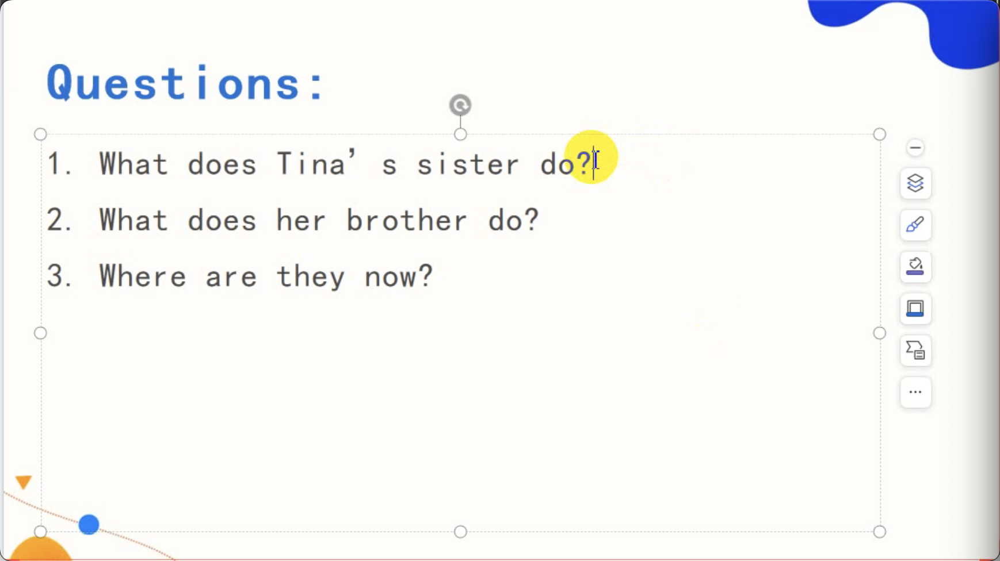
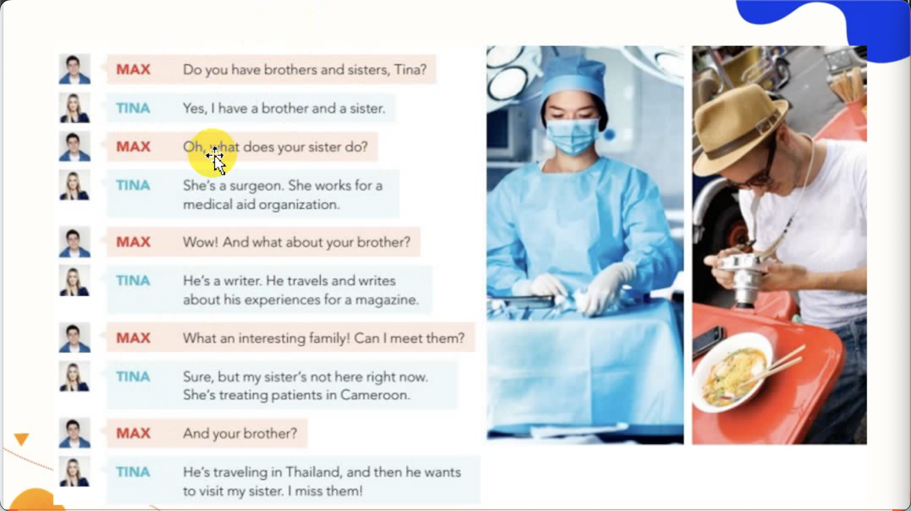
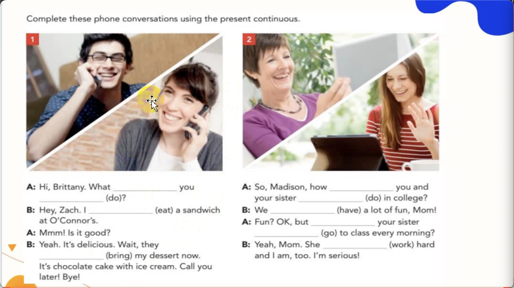
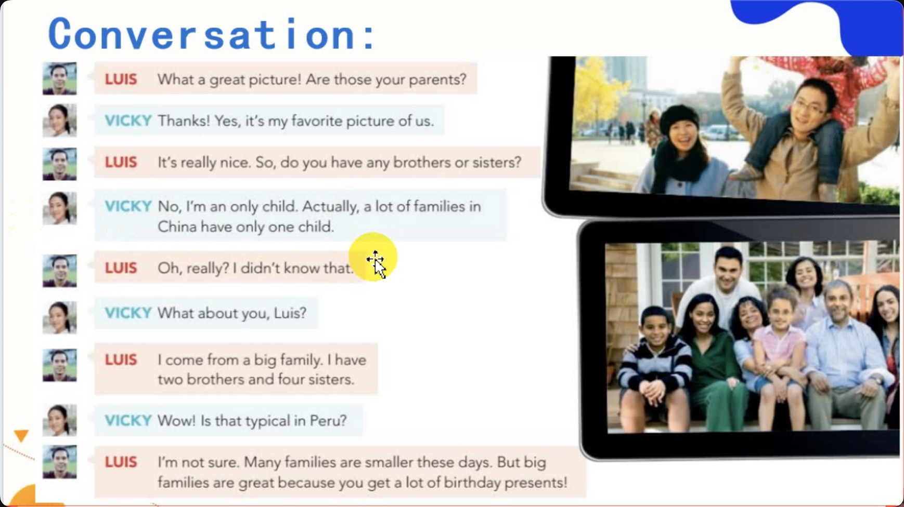
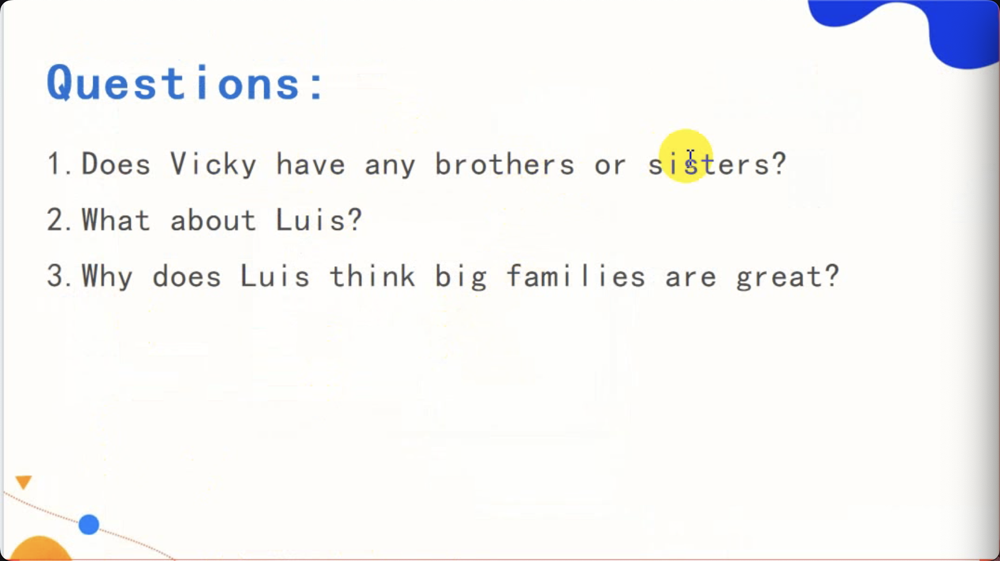
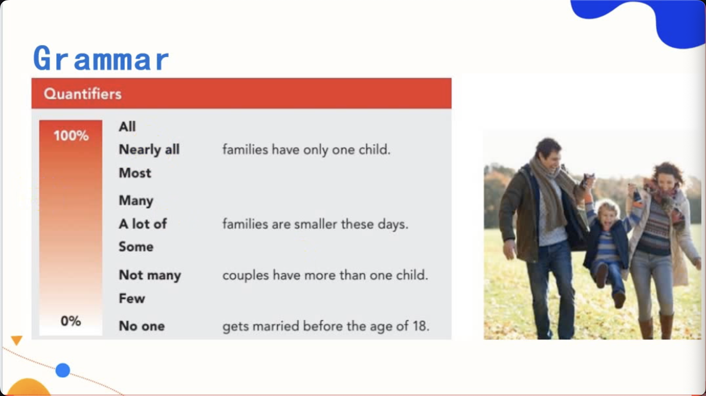
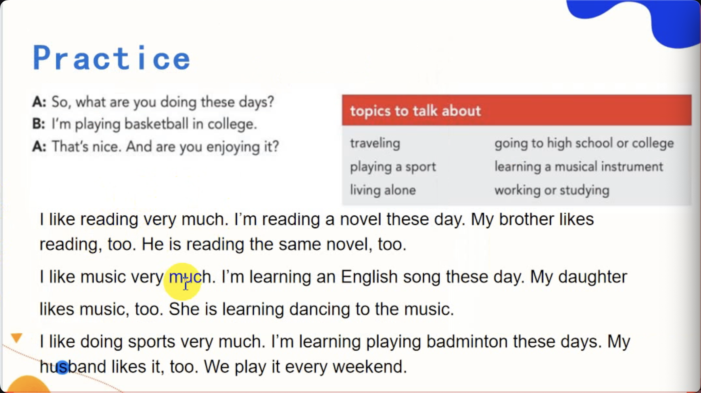
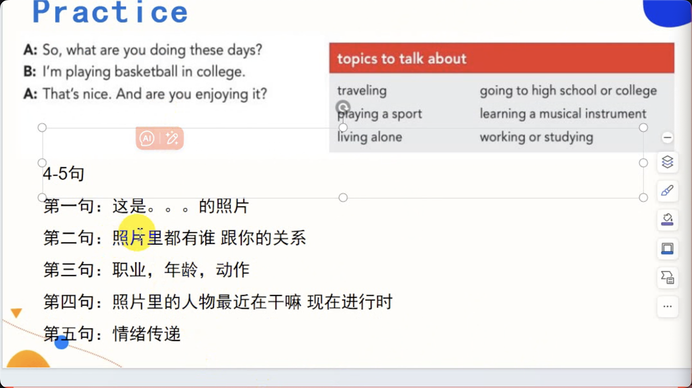

- grandfather = grandpa 
- grandmother = grandma

- father/dad/daddy
- mother/mom/mum-mommy

- wife/husband
- father-in-law
- mother-in-law

- son/daughter
- brother 
- sister
- uncle
- aunt
- cousin
- niece
- sister-in-law
- sibling

Q: What's the relationship between Robert and Jushua?
A: They're father and son.

Q: What's the relationship between Joshua and Andrew?
A: They're uncle and nephew.

Q: What's the relationship between Joshua and Nicole?
A: They're cousins.

Q: How many cousins do you have？

She is a surgeon. She works for a medical aid organization.

He is a writer. He travels and writes about his expriences for a magzine.

Her sister is treating patients in Cameroon. And her brother is in Thailand.

# Practice

## 语法
- 现在进行时：说话这一刻正在进行的动作 + 近期正在进行的动作。（通常描述：习惯性+职业+喜好+时刻表）
- `代词`
  - 回答问题时，合理使用`人称代词`
## 短语
- an only child（独生子女）
- get engaged（订婚）
- Cameroon（喀麦隆）
## 发音
- 小词（没关键信息传递的词），在连读时会被弱化。
- have-a （连读）

