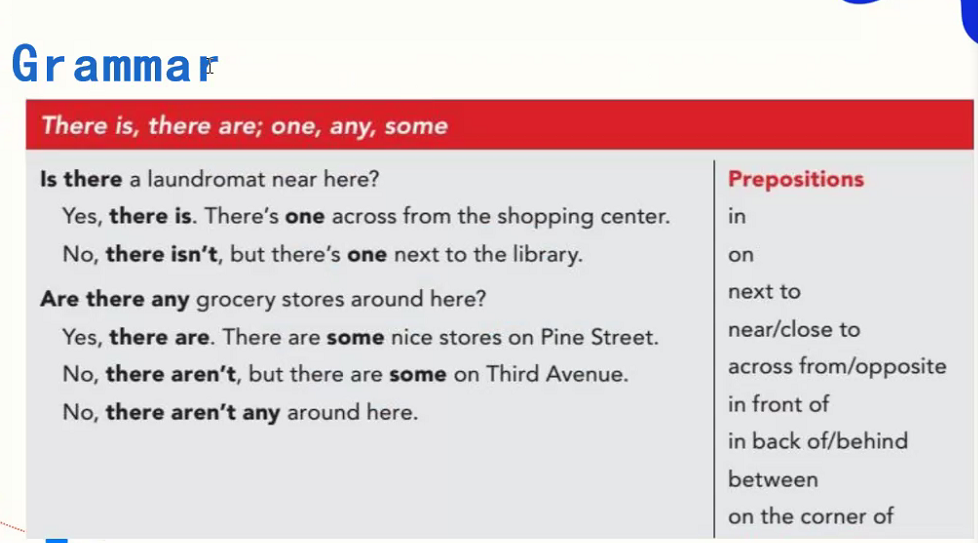

## Warming up

## Questions


```
1. Where are they?
  - They were in the lobby of their appartment.
2. What shops are there near there?
  - some grocery stores, a hair salon
3. What doese the lady mean at last?
  - She means the man needs to go to the hair salon.
  - She thinks the man's hair is too long.
  - She thinks the man should have his hair cut.
```

！听力理解需要透过发音和单词`理解内容中发生了什么，以及人物关系`，而不仅仅是听懂发音和单词的意思。

## Conversation: laundry
- laundromat 
   - n 自动洗衣店；〈美〉自动洗衣店的招牌
- salon
  - n 沙龙(旧时作家、艺术家等在名流家中定期举行的聚会);(大宅中的)客厅，会客室;美容厅;美发厅;高级服装店;
- lobby
  - n. 大堂;游说;(公共建筑物进口处的)门厅，前厅，大厅;(就某问题企图影响从政者的)游说团体;(英国议会的)民众接待厅;
  - v. 游说(从政者或政府);

## Grammar


there be 句型（存在句）
翻译：有
- Be动词的使用遵循 `就近原则`，离它最近的词决定单复数。
  - There are tow girls and a boy in the room.
  - There is a boy and two girls in the room.


```
A: Is there a bank in the shopping district?
B: Yes, there is.
B: No, there isn't.
```

```
- in front of 在外部的前面
- in the front of 在内部的前面
```

- on street 
- electronics store 电子商店
---

练习表达位置关系
```
在 star plaza hotel

A: Is there a cafe near there?
B: Yes, there is one across from the hotel on the other side the avenue.
```
```
在第一国家银行

A: Is there a gas station near here?
B: Yes, there is one gas station behind here.
```

## Questions
```
1. How does the woman like her new apartment? And why?
  - She loves it, because it's convinient and safe.
2. What's wrong with the new apartment?
  - There's a lot of noise on weekend. 
```
- much traffic 车流量比较大

## Grammar

- a lot of = lots of  = many + much
- few 几个
- litter 一些

看图回答问题


1. Yes, there is much parking.
2. Yes, there're many apartment buildings .
3. There is no traffic.
4. There are lots of drugstores in my neighborhood.
5. Yes, there is much noise downstairs.
6. No there aren't any shopping malls.
7. Yes, there is some pullution in winter.
8. There're many fast-food restaurants, because many white-collar live here.

## Practice


5到6句即可