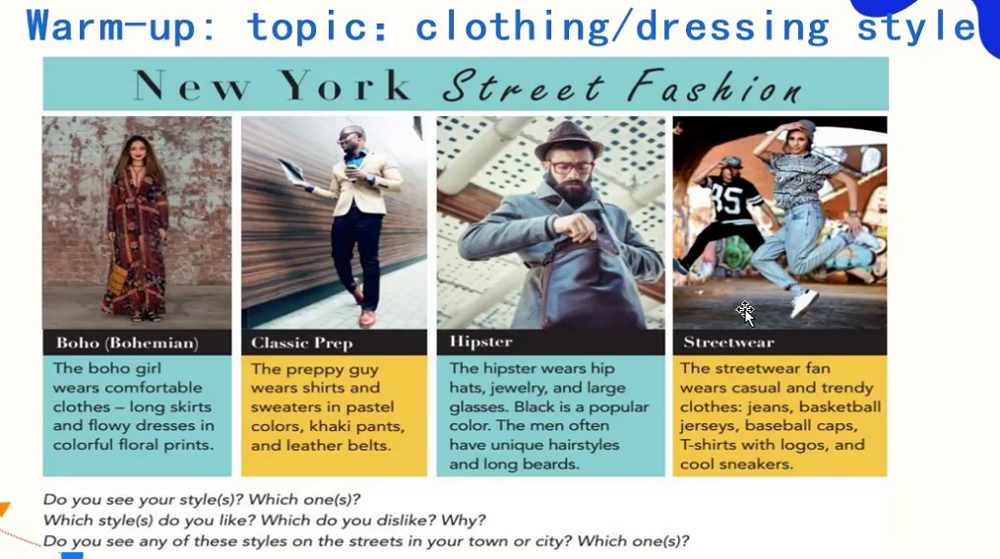
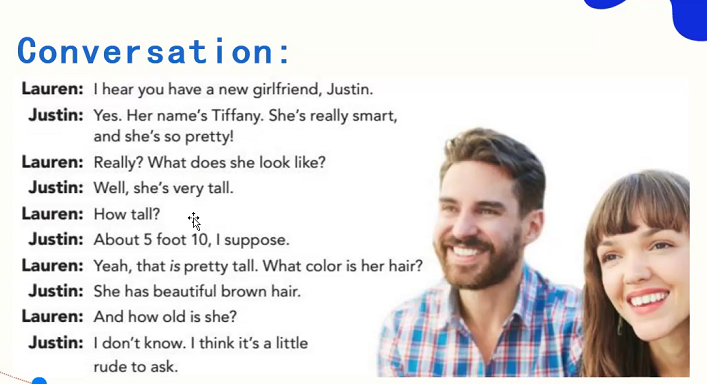
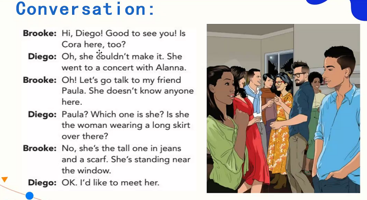
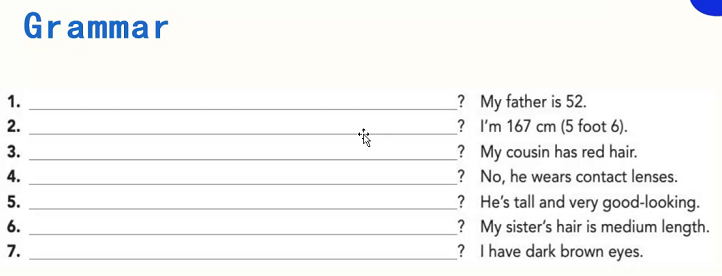
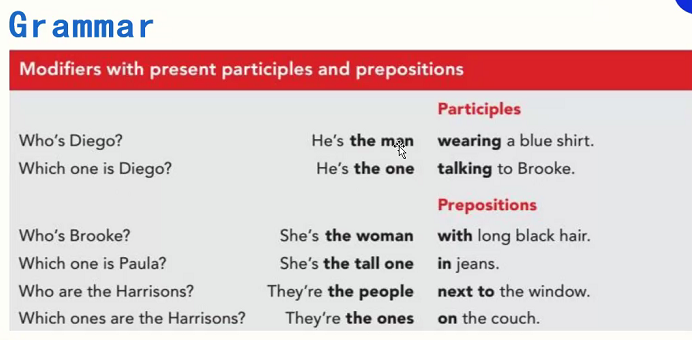
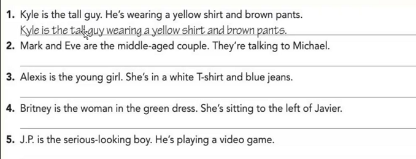
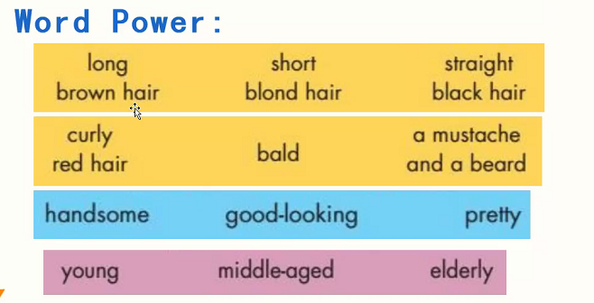
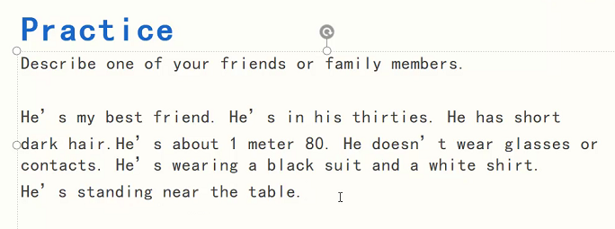

## Warm-up

topic/dressing style


- long skirt（长裙）
  - skirt 短裙
- casual（休闲的）

New York Street Fashion

```
Boho(Bohemian)

The boho girl wears comfortable clothes——long skirts and flowy dresses in colorful floral pints.
```

```
Classic Prep

The preppy guy wears shirts and sweaters in pastel colors, khaki pants, and leather belts.
```

```
Hipster

The hipster wears hip hats, jewelry, and large glasses. Black is a popular color. Then men often have unique hairstyles and long beards.
```

```
Streetwear

The streetwear fan wears casual and trendy clothes: jeans, basketball jerseys, baseball caps, T-shirts with logos, and cool sneakers.
```

练习

I prefer Streetwear, because it looks energetic and comfortable.


## Questions
1. What does his girlfriend look like?
2. What color is her hair?

I hear you have a new girlfriend, Justin.


how 
  - long
  - often
  - many
  - much
  - tall
  - deep
  - far

### 发音
1. 连读
  - have a
2. 失去爆破（有味道，有力道，没声音）
  - What does
  - About 5 foot 

## Conversation

听力要注意：时间，地点，人物关系，故事内容

Good to see you.
We made it.

### 发音
1. 失去爆破
  - Good to see you 
2. 连读
  - Which one is

# Grammar


- contacts（隐形眼镜）
- dark hair（黑发）
- in her thirties.（三十多岁）



Mark and Eve are the middle-aged couple talking to Michael.

Alexis is the young girl in a white T-shirt and blue jeans.

Britney is the woman in the green dress sitting to the left of Javier.

J.P. is the serious-looking boy playing a video game. 


## 词汇



## 写作


Shukai Li is a handsome man. He's in his thirties. Of course, he is my best friend. 
He has curly dark hair. He's about 1 meter 70. 
He doesn't wear glasses now, because he did  eyes surgery ten years ago.
He often wears class prep at work. He's wearing a black suit and a white shirt.
He is sitting on the couch.
